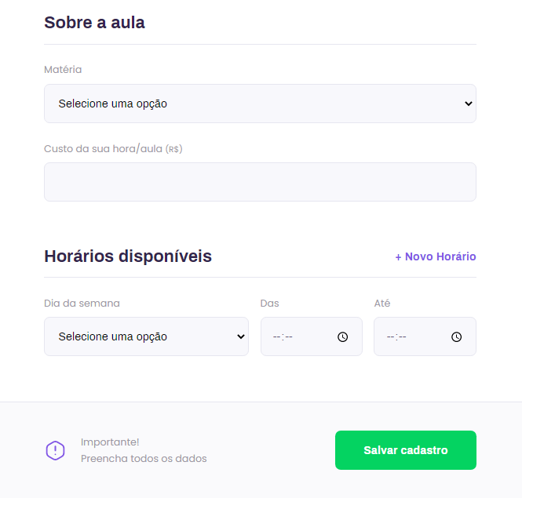

 
    

<h2> O projeto Proffy é um local onde você poderá encontrar diversos professores em varias materias e diferentes horários e se você é professor, cadastre-se e comece a dar aulas! </h2>  

 (Projeto desenvolvido na NLW #2) 

<h1> PAGINA INICIAL: </h1>

 
    

<h1> CADASTRO DOS PROFFYS: </h1>

 
    
    

<h1> PROFFYS DISPONÍVEIS: </h1>

 
    

 
<h1>TECNOLOGIAS UTILIZADAS:</h1>
<h2> FRONT-END </h2>

 
    
    
 HTML 

 

 
    
    
 CSS 

 

 
    
    
 Javascript 

 

<h2> BACK-END </h2>

 
    
    
 Node.js 

 

 
    
    
 SQLite 

 

<h2> TEMPLATE ENGINE </h2>

 
    
    
 Nunjucks 

 

## Getting started

para clonar e rodar essa aplicação, você vai precisar executar as seguintes tarefas:

Clonar esse repositório:
 - git clone https://github.com/matheuspaiva1/NLW-2

Entrar no repositório:
 - cd NLW-2-master/NLW 2

Instalar as dependências:
 - npm install

Rodar o app:
 - npm run dev

Acessar a aplicação por:
 - http://localhost:3000

 

<strong> <h5 align = "center"> </> By: Matheus Paiva </h5> </strong>

